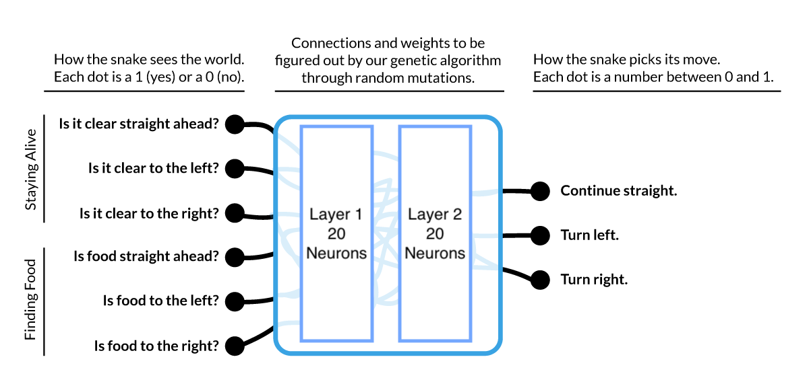
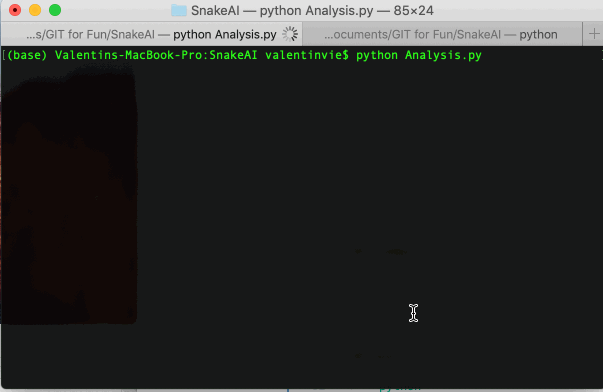
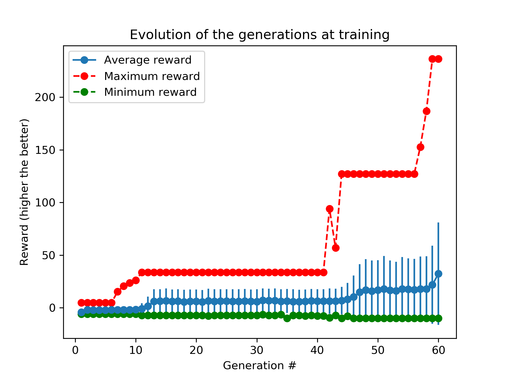
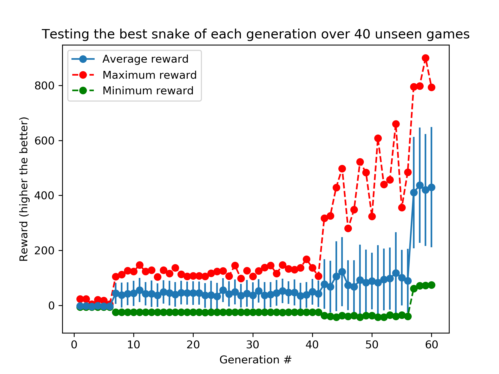

# SnakeAI

## What is this?
A neural network (NN) trained with a genetic algorithm to play the game *Snake*.

The NN has to choose between three actions at every step during the game: `'STRAIGH'` (go straight), `'RIGHT'` and `'LEFT'`. When the snake hit a wall or bite its tail, the game is over.


## Structure
The project is divided into four files:
- The Snake game is in `SnakeGame.py`. It contains the game mechanics and the UI.
- The Neural Network settings are in `NeuralNet.py`.
- The optimization process using a genetic algorithm is located in `GeneticAlg.py`.
- Finally the data analysis and results are processed and compiled in `Analysis.py`.

## The Snake Game

There are two kinds of snake games: training games and testing games. For training games, we bias the random number generator controling the position of the food. Each RNG will provide a different game depending on the seed. During the training, we only allow 100 seeds. Then, there are only 100 snake games the NN can play because only 100 sequences of food placement are allowed. 

When testing we change the seeds and the NN has to perform on previously unseen games.

See in `SnakeGame.py`:
```python
def __init__(self, size = (10,20), trainingGame = True, maxMoves=100):
	[...]
	if trainingGame: 
		# It is a training game we only train over 100 different games.
		# A game is a unique succession of food placement.
		# We basically bias the random number generator to only have 100 sequences
		self.randgen = rd.Random(rd.randint(0,100))
	else: 
		# The game has not been seen before. The random number 
		# generator generate a sequence of food placement never seen before.
		self.randgen = rd.Random(rd.randint(100,10000))

	self.chooseFoodPosition()		

def chooseFoodPosition(self):
	[...]
	self.food = ((self.randgen.randint(1,self.size[0])-1, self.randgen.randint(1,self.size[1])-1))
	while self.food in self.snake:
		self.food = ((self.randgen.randint(1,self.size[0])-1, self.randgen.randint(1,self.size[1])-1))
	return True
```

A neural network plays the game by executing:
```python
NNRandom = NeuralNet()
G.NNetPlayShow(NNRandom)
```
or 
```python
NNRandom = NeuralNet()
G.NNetPlay(NNRandom)
```

A human can also play the game by executing:
```python
G = SnakeGame()
G.hummanPlay()
```

## The Neural Network

The neural network receives an input of dimension 6 and has to output a vector of dimension 3. The highest component of the output decides the decision that is made.

The NN contains two hidden layers of each 20 neurons. These parameters are decided empirically and according to the processing power I had available.

<p align="center">
	
</p>


The input answers the following questions with `0` when `False` and `1` when `True`:
1. Is it clear `STRAIGHT` ?
2. Is it clear `LEFT` ?
3. Is it clear `RIGHT` ?
4. Is there food `STRAIGHT` ?
5. Is there food `LEFT` ?
6. Is there food `RIGHT` ?

To learn more about how we create the input, check `createInputNN(...)` in `SnakeGame.py`.

## Example

Here is an example of the evolution of the snakes. The code used to generate this is in `Analysis.py`.
<p align="center">
	
</p>

## Analysis
All NN generated and tested in the genetic algorithm are saved in `NNsave.pickle`. I could not upload the file because the size exceeds the limit but the parameters are saved in `Analysis.py`. Execute `python Analysis.py` to get new (hopefully similar) data.

NNsave is a dictionnary with the following structure:
```python
NNsave = {
	1: [(NN_best_gen1, reward1), (NN_2best_gen1, reward2)...(NN_worst_gen1, rewardN)]
	1: [(NN_best_gen2, reward1), (NN_2best_gen2, reward2)...(NN_worst_gen2, rewardN)]
	...
	60: [(NN_best_gen60, reward1), (NN_2best_gen60, reward2)...(NN_worst_gen60, rewardN)]
}
```

Here is the evolution of the reward depending on the number of generation when **training** the NN (executing the genetic algorithm). All the parameters to generate this graph can be found in `Analysis.py`.

<p align="center">
	
</p>

Here is the evolution of the reward depending on the number of generation when **testing** the NN (on previously unseen games).

<p align="center">
	
</p>

We can notice a breakthough has been made by the natural selection around generation #56. The snakes move in counter-clockwise loops until a food is on the way. Generation 60:

<p align="center">
	
</p>

## Usage

You will need the following modules:
- `random`
- `collections` for the snake representation.
- `curses` for the UI.
- `numpy`
- `tqdm`, not absolutely necessary, replace `for genNb in tqdm(range(maxGen, generation))` by `for genNb in range(maxGen, generation)` in `GeneticAlg.py`.
- `multiprocessing` to run the genetic algorithm on multiple threads.


